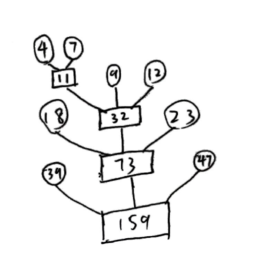

# 数据结构作业

## 第11章

#### 11.1

1. 5路
2. 2趟, 至少10路

#### 11.2

内部排序生成2000个归并段, 进行4-路归并, 则需要$\lceil\log_4 2000\rceil$ = 6趟, 再加上内部排序, 共扫描7趟. 而每趟20000次I/O, 故140000次

#### 11.5

因为输入和输出是同步进行的.

可以, 置换选择排序关键是找到大于MINMAX标志的最小值, 无论是插入还是选择还是交换都可以完成排序, 找到这个最小值.

#### 11.11

一共读取434次