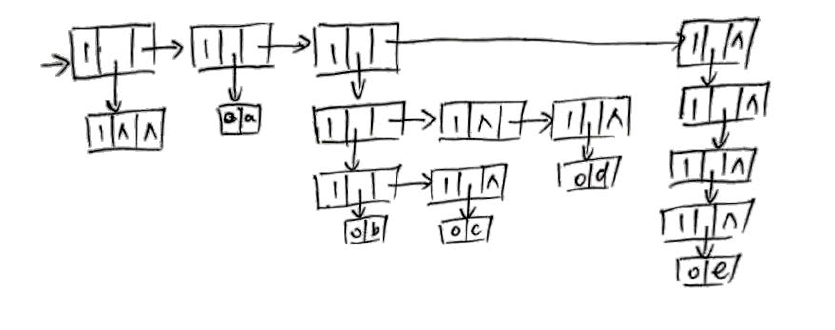
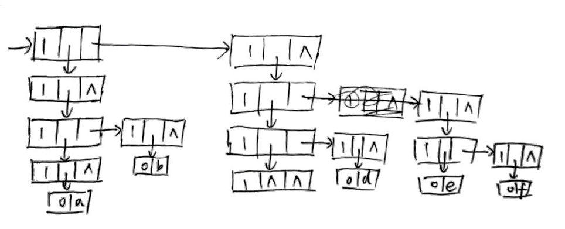

# 数据结构

## 第五章

#### 5.1

1. 288
2. 1282
3. 1072
4. 1276

#### 5.8

`k = 2i+(j-1)+(i+1)%2 `

#### 5.12

1. 
2. 

#### 5.13

1. $((x,(y)),((()),(),(z)))$
2. $(((a,b,()),()),(a,(b)),())$

#### 5.15

集合$S$的幂集记为$P(S)$,

若集合$S=\emptyset$, $P(S)=\{\emptyset\}$,

若集合$S\neq\emptyset$, $P(S) = (\bigcup_{a \in S}P(S \setminus a)) \cup \{S\}$

#### 5.20

```c
#include <math.h>
#include <stdio.h>
#include <stdlib.h>
#include <time.h>

int reduce_sum(int count, int len, int *array);
int reduce_pro(int count, int len, int *array);
void generate_random_matrix(int *matrix_size, int *matrix, int order);
void loop(int count, int all, int order, int *matrix, int *matrix_size,
          int *exp_list);
void print_item(int *martix, int *matrix_size, int *exp_list, int order);

int ORDER = 3;
int MATRIX_SIZE[] = {5, 5, 5};
int IS_FIRST = 1;

int main()
{
    int matrix_total_size = reduce_pro(ORDER, ORDER, MATRIX_SIZE);
    int *matrix = (int *)malloc(sizeof(int) * matrix_total_size);
    int *exp_list = (int *)malloc(sizeof(int) * ORDER);
    generate_random_matrix(MATRIX_SIZE, matrix, ORDER);

    int max_all_exp = reduce_sum(ORDER, ORDER, MATRIX_SIZE) - ORDER;
    for (int i = max_all_exp; i >= 0; i--)
    {
        loop(0, i, ORDER, matrix, MATRIX_SIZE, exp_list);
    }
    return 0;
}

int reduce_sum(int count, int len, int *array)
{
    int sum = 0;
    for (int i = 0; i < fmin(len, count); i++)
    {
        sum += array[i];
    }
    return sum;
}
int reduce_pro(int count, int len, int *array)
{
    int pro = 1;
    for (int i = 0; i < fmin(len, count); i++)
    {
        pro *= array[i];
    }
    return pro;
}

void generate_random_matrix(int *matrix_size, int *matrix, int order)
{
    srand(time(NULL));
    for (int i = 0; i < reduce_pro(order, order, matrix_size); i++)
    {
        *(matrix + i) = rand() % 10;
    }
}

void loop(int count, int all, int order, int *matrix, int *matrix_size,
          int *exp_list)
{
    int all_left = all - reduce_sum(count, order, exp_list);
    if (count == order - 1)
    {
        if (all_left < matrix_size[count])
        {
            exp_list[count] = all_left;
            print_item(matrix, matrix_size, exp_list, order);
        }
    }
    else
    {
        for (int i = fmin(all_left, matrix_size[count] - 1); i >= 0; i--)
        {
            exp_list[count] = i;
            loop(count + 1, all, order, matrix, matrix_size, exp_list);
        }
    }
    return;
}

void print_item(int *matrix, int *matrix_size, int *exp_list, int order)
{
    int offsets = 0;
    for (int i = 0; i < order; i++)
    {
        offsets += (exp_list[i] * reduce_pro(i, order, matrix_size));
    }
    int coef = *(matrix + offsets);
    if (coef != 0)
    {
        if (!IS_FIRST)
        {
            printf("+");
        }
        else
        {
            IS_FIRST = 0;
        }
        if (coef != 1)
        {
            printf("%d", coef);
        }
    }
    for (int i = 0; i < order; i++)
    {
        int _exp = *(exp_list + i);
        if (_exp == 0)
        {
            continue;
        }
        else
        {
            printf("x_%d", i);
            if (_exp != 1)
            {
                printf("^%d", _exp);
            }
        }
    }
}
```


#### 5.27

```c
#include <stdio.h>
#include <unistd.h>
#include <sys/time.h>
#include <stdlib.h>

#define TYPE int

typedef struct OLNode
{
    int i, j;
    TYPE e;
    struct OLNode *right, *down;
} OLNode, *OLink;

typedef struct CrossList
{
    OLink *rhead, *chead;
    int mu, nu, tu;
} CrossList;

void matrix_plus(CrossList *M_A, CrossList *M_B);
void create_node(OLNode *node, int i, int j, TYPE e);
void create_martix(CrossList *M, int mu, int nu);
void generate_random_matrix(CrossList *M, int tu);
void insert_ele(CrossList *M, int i, int j, TYPE e);
void show_matrix(CrossList *M);
void show_zero(int num);
int random(int range);

int main()
{
    int width = 6;
    int height = 6;
    CrossList M_A, M_B;
    create_martix(&M_A, width, height);
    create_martix(&M_B, width, height);

    generate_random_matrix(&M_A, 8);
    generate_random_matrix(&M_B, 5);
    printf("matrix A:\n");
    show_matrix(&M_A);
    printf("matrix B:\n");
    show_matrix(&M_B);

    matrix_plus(&M_A, &M_B);
    printf("matrix A + matrix B:\n");
    show_matrix(&M_A);
    return 0;
}

void matrix_plus(CrossList *M_A, CrossList *M_B)
{
    if (!(M_A->mu == M_B->mu && M_A->nu == M_A->nu))
    {
        exit(-1);
    }
    for (int i = 0; i < M_B->mu; i++)
    {
        OLNode *p = M_B->rhead[i];
        while (p)
        {
            insert_ele(M_A, p->i, p->j, p->e);
            p = p->right;
        }
    }
}
void create_node(OLNode *node, int i, int j, TYPE e)
{
    node->i = i;
    node->j = j;
    node->e = e;
    node->right = NULL;
    node->down = NULL;
}

void create_martix(CrossList *M, int mu, int nu)
{
    if (M)
    {
        free(M);
    }
    M->mu = mu;
    M->nu = nu;
    M->tu = 0;
    M->rhead = (OLink *)malloc((M->mu) * sizeof(OLink));
    M->chead = (OLink *)malloc((M->nu) * sizeof(OLink));
    if (!M->rhead || !M->chead)
    {
        exit(-1);
    }
    for (int i = 0; i < M->mu; i++)
    {
        M->rhead[i] = NULL;
    }
    for (int i = 0; i < M->nu; i++)
    {
        M->chead[i] = NULL;
    }
}

void insert_ele(CrossList *M, int i, int j, TYPE e)
{
    if (!(M && i < M->mu && j < M->nu))
    {
        exit(-1);
    }
    OLNode *p = (OLNode *)malloc(sizeof(OLNode));
    create_node(p, i, j, e);
    if (M->rhead[i] == NULL || M->rhead[i]->j > j)
    {
        M->tu++;
        p->right = M->rhead[i];
        M->rhead[i] = p;
    }
    else
    {
        OLNode *q = M->rhead[i];
        while (q)
        {
            if (q->j == j)
            {
                q->e += e;
                break;
            }
            else if (!q->right)
            {
                M->tu++;
                q->right = p;
                break;
            }
            else if (q->j < j && q->right->j > j)
            {
                M->tu++;
                p->right = q->right;
                q->right = p;
                break;
            }
            else
            {
                q = q->right;
            }
        }
    }
    if (M->chead[j] == NULL || M->chead[j]->i > i)
    {
        p->down = M->chead[j];
        M->chead[j] = p;
    }
    else
    {
        OLNode *q = M->chead[j];
        while (q)
        {
            if (q->i == i)
            {
                break;
            }
            else if (!q->down)
            {
                q->down = p;
                break;
            }
            else if (q->i < i && q->down->i > i)
            {
                p->down = q->down;
                q->down = p;
                break;
            }
            else
            {
                q = q->down;
            }
        }
    }
}

void show_matrix(CrossList *M)
{
    for (int i = 0; i < M->mu; i++)
    {
        OLNode *p = M->rhead[i];
        if (!p)
        {
            show_zero(M->nu);
        }
        else
        {
            show_zero(p->j);
            while (p)
            {
                printf("%d\t", p->e);
                if (p->right)
                {
                    show_zero(p->right->j - p->j - 1);
                }
                else
                {
                    show_zero(M->nu - p->j - 1);
                }
                p = p->right;
            }
        }
        printf("\n");
    }
}

void show_zero(int num)
{
    for (int i = 0; i < num; i++)
    {
        printf("0\t");
    }
}

void generate_random_matrix(CrossList *M, int tu)
{
    struct timeval _time;
    gettimeofday(&_time, NULL);
    srand((unsigned)(_time.tv_sec * _time.tv_usec));
    usleep(1);
    for (int i = 0; i < tu; i++)
    {
        insert_ele(M, random(M->mu), random(M->nu), random(10) + 1);
    }
}

int random(int range)
{
    return rand() % range;
}
```

#### 5.30

```c
//本段代码没有写相应结构, 不能运行
//仅写出流程
#define max(a, b) ((a > b) ? a : b)

int GListDepth(GList L)
{
    if (!L)
    {
        return 1; //空表深度为1
    }
    else if (L->tag == ATOM)
    {
        return 0; //原子深度为0
    }
    else
    {
        return max(GListDepth(L->hp) + 1, GListDepth(L->tp));
        //表头深度+1 和 表尾深度 中较大的那个即该表深度
    }
}
```

