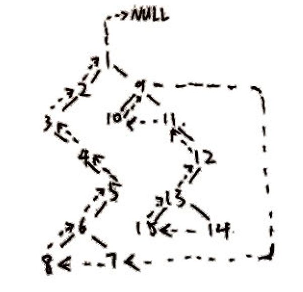
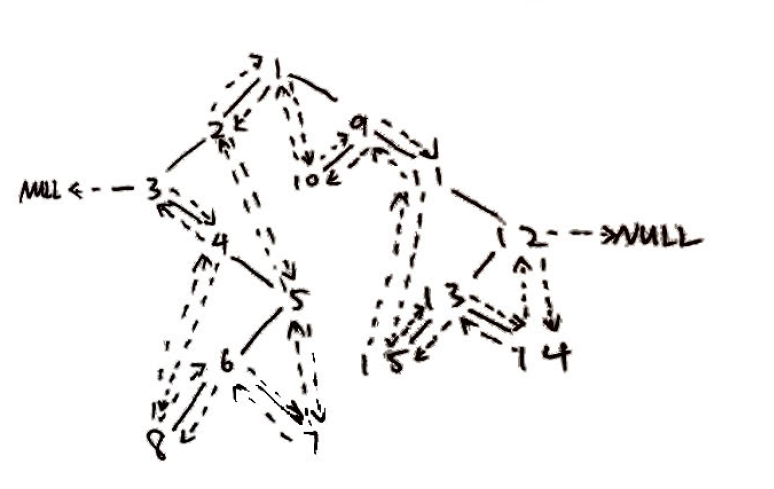
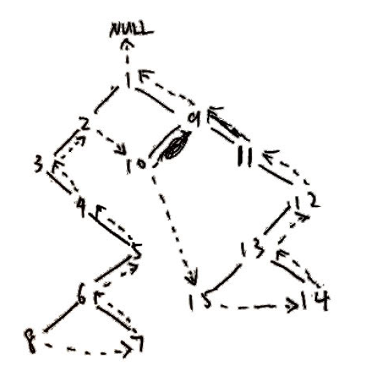

# 数据结构作业

## 第6章

#### 6.5

$\sum^k_{m=1} m*n_m -\sum^k_{m=1}n_m +k+1$

####  6.18

若给定二叉树, 就存在唯一的中序序列和后序序列, 从而可以确定, 与是否线索化无关;

若没有给定, 仅凭线索信息, 我们只能得到树的中序序列, 无法得到后序序列.

####  6.20

1. 先序: 1, 2, 3, 4, 5, 6, 8, 7, 9, 10, 11, 12, 13, 15, 14

   前驱线索化

   

2. 中序: 3, 4, 8, 6, 7, 5, 2, 1, 10, 9, 11, 15, 13, 14, 12

   全线索化

   

3. 后序: 8, 7, 6, 5, 4, 3, 2, 10, 15, 14, 13, 12, 11, 9, 1

   后继线索化

   

#### 6.31

设先序序列为 $\{a_1, a_2, a_3, \cdots, a_n\}$, 中序序列为 $\{b_1, b_2, b_3, \cdots, b_n\}$. 由先序序列性质可知, 第一个节点$a_1$一定是根节点. 同时, 每个节点一定在中序序列中出现一次, 设$b_m = a_1$, 那么子序列$\{b_1, b_2, b_3, \cdots, b_{m-1}\}=\{a_2, a_3, a_4, \cdots, a_{m}\}$是根节点$b_m=a_1$的左子树, 子序列$\{b_{m+1}, b_{m+2}, \cdots, b_{n}\}=\{a_{m+1}, a_{m+2}, \cdots, a_{n}\}$是根节点$b_m=a_1$的右子树. 再对左右子树的先序中序序列进行同样的分解, 递归至叶子节点, 即可获得整棵树的结构. 

#### 6.37

```c
//本段代码没有实现相应结构, 不能运行

// 用到的基本操作函数
void visit(BiTNode p);           // 访问节点p
void init_stack(Stack *S);       // 初始化栈
int empty_stack(Stack *S);       // 判断是否为空栈
void push(Stack *S, BiTNode *p); // 将节点p压入栈S
BiTNode *pop(Stack *S);          // 退栈, 获取栈顶节点p

/********************************************
Function name:  pre_order_traverse_by_stack
Purpose:        以栈的方式来先序遍历给定二叉树
Params:
    @BiTree     *T:         需要遍历的二叉树指针
    @void       *visit :    访问节点的操作函数(指针)
Return:         void
********************************************/
void pre_order_traverse_by_stack(BiTree *T, void (*visit)(BiTNode p))
{
    BiTNode *p;
    Stack S;
    init_stack(&S);
    push(&S, T);
    p = T;
    while (p)
    {
        visit(*p);          // 访问节点
        if (p->right_child) // 若有右子树, 压入栈
        {
            push(&S, p->right_child);
        }
        if (p->left_child) // 若有左子树, 访问左子树
        {
            p = p->left_child;
        }
        else // 若无左子树
        {
            if (!empty_stack(&S)) // 若栈非空, 退栈, 访问栈顶元素
            {
                p = pop(&S);
            }
            else // 若栈空, 结束遍历
            {
                return;
            }
        }
    }
}
```


#### 6.43

```c
//本段代码没有实现相应结构, 不能运行

void switch_left_and_right(BiTree *T)
{
    if (!T)
    {
        return;
    }

    BiTNode *temp;
    temp = T->left_child;
    T->lefr_child = T->right_child;
    T->right_child = temp;

    switch_left_and_right(T->left_child);
    switch_left_and_right(T->right_child);
}
```


####  6.49

```c
//本段代码没有实现相应结构, 不能运行

// 用到的基本操作函数
void init_queue(Queue *Q);           // 初始化队列
void get_head(Queue *Q, BiTNode *p); // 获取队首元素
void push(Queue *Q, BiTNode *p);     // 压入队尾
int empty_queue(Queue *Q);           // 判断是否为空队列

/********************************************
Function name:  is_complete_bitree
Purpose:        判断给定二叉树是否为完全二叉树, 利用队列
Params:
    @BiTree     T:  需要判断的二叉树
Return:         int
    0:          不是完全二叉树
    1:          是完全二叉树
********************************************/
int is_complete_bitree(BiTree *T)
{
    Queue Q;
    BiTNode *p;
    int flag = 0; // 是否遇到过非满节点
                  // 即只有左子树, 或只有右子树, 或叶子
    init_queue(&Q);
    push(&Q, T);
    while (!empty_queue(&Q)) // 层遍历, 循环至队列为空
    {
        p = get_head(&Q);
        if (p->left_child && p->right_child) // 若有左右子树
        {
            if (!flag) // 若没有遇到非满节点, 将左右子树压入队列
            {
                push(&Q, p->left_child);
                push(&Q, p->right_child);
            }
            else // 遇到过, 则说明树不是完全的
            {
                return 0;
            }
        }
        else if (p->left_child) // 只有左子树, 非满节点
        {
            if (!flag) // 若没有遇到非满节点, 左子树压入队列
            {
                push(&Q, p->left_child);
                flag = 1;
            }
            else // 遇到过, 则说明树不是完全的
            {
                return 0;
            }
        }
        else if (p->right_child) // 只有右子树, 则说明树不是完全的
        {
            return 0;
        }
        else // 叶子节点, 其后的所有节点必须都是叶子
        {
            flag = 1;
        }
    }
    return 1; // 遍历完成, 说明是完全的
}
```


#### 6.71

```c
//本段代码没有实现相应结构, 不能运行

/********************************************
Function name:  traverse_print
Purpose:        按题中指定方式打印以孩子-兄弟链储存的树
                此函数供外部调用
Params:
    @Tree       T:     需要打印的树
Return:         void
********************************************/
void traverse_print(Tree T)
{
    __traverse_print(T, 0);
}

/********************************************
Function name:  __traverse_print
Purpose:        按题中指定方式打印以孩子-兄弟链储存的树
                此函数只能由traverse_print调用和自身递归调用
                函数主体采用递归的方式运行
Params:
    @Tree       T:      需要打印的树
    @int        level   该子树的根节点在原始的树中的层数(记原树根节点层数为0)
                        用于控制打印的制表符数量
Return:         void
********************************************/
void __traverse_print(Tree T, int level)
{
    if (T)
    {
        for (int i = 0; i < level; i++) // 打印当前树的根节点
        {
            printf("\t");
        }
        printf("%s\n", T->data);

        __traverse_print(T->first_child, level + 1); // 递归访问第一个孩纸节点
        __traverse_print(T->first_sibling, level);   // 递归访问第一个兄弟节点
    }
}
```


#### 6.72

```c
//本段代码没有实现相应结构, 不能运行

/********************************************
Function name:  traverse_print
Purpose:        按题中指定方式打印以孩子链储存的树
                此函数供外部调用
Params:
    @CTree      T:       需要打印的树
Return:         void
********************************************/
void traverse_print(CTree T)
{
    CTBox root = T.nodes[T.r];
    __traverse_print(T, root, 0);
}

/********************************************
Function name:  __traverse_print
Purpose:        按题中指定方式打印以孩子链储存的树
                此函数只能由traverse_print调用和自身递归调用
                函数主体采用递归的方式运行
Params:
    @CTree      T:      需要打印的原始的树
    @CTBox      box:    当前访问的节点
    @int        level   当前访问节点在原始的树中的层数(记原树根节点层数为0)
                        用于控制打印的制表符数量
Return:         void
********************************************/
void __traverse_print(CTree T, CTBox box, int level)
{
    if (box.data) // 节点非空
    {
        for (int i = 0; i < level; i++) // 打印当前节点
        {
            printf("\t");
        }
        printf("%s\n", box.data);

        ChildPtr p = box.firstchild;
        while (p) // 递归访问所有孩子节点
        {
            __traverse_print(T, T.nodes[p->child], level + 1);
            p = p->next;
        }
    }
}
```

