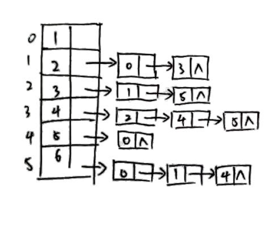
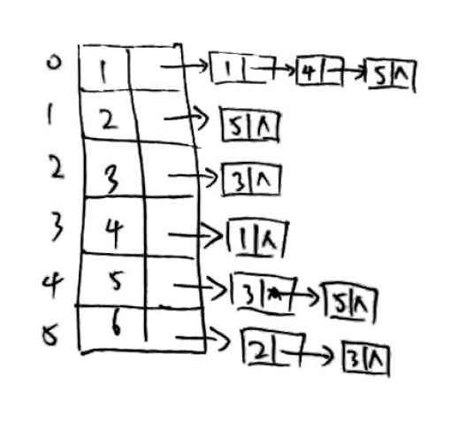
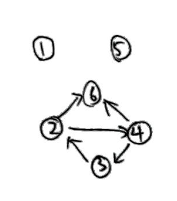
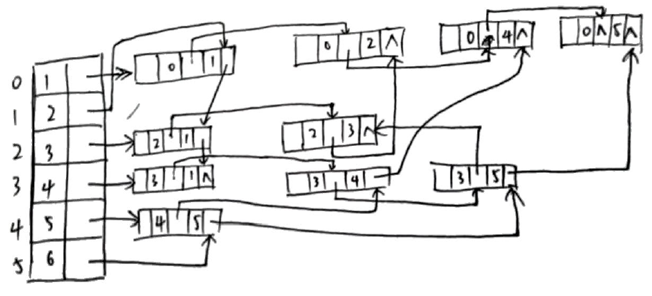

# 数据结构作业

## 第7章

#### 7.1

1. | 顶点   | 1    | 2    | 3    | 4    | 5    | 6    |
  | ---- | ---- | ---- | ---- | ---- | ---- | ---- |
  | 入度   | 3    | 2    | 1    | 1    | 2    | 2    |
  | 出度   | 0    | 2    | 2    | 3    | 1    | 3    |

2. |      | 1    | 2    | 3    | 4    | 5    | 6    |
   | ---- | ---- | ---- | ---- | ---- | ---- | ---- |
   | 1    | 0    | 0    | 0    | 0    | 0    | 0    |
   | 2    | 1    | 0    | 0    | 1    | 0    | 0    |
   | 3    | 0    | 1    | 0    | 0    | 0    | 1    |
   | 4    | 0    | 0    | 1    | 0    | 1    | 1    |
   | 5    | 1    | 0    | 0    | 0    | 0    | 0    |
   | 6    | 1    | 1    | 0    | 0    | 1    | 0    |

3. 

4. 

5. 

#### 7.3



深度优先序列: $1, 2, 3, 4, 5, 6$

广度优先序列: $1,2, 3, 5, 6, 4$

#### 7.10

| 事件       | ve   | vl   |
| -------- | ---- | ---- |
| $\alpha$ | 0    | 0    |
| A        | 1    | 20   |
| B        | 6    | 24   |
| C        | 17   | 26   |
| D        | 3    | 19   |
| E        | 34   | 34   |
| F        | 4    | 8    |
| G        | 3    | 3    |
| H        | 13   | 13   |
| I        | 1    | 7    |
| J        | 31   | 31   |
| K        | 22   | 22   |
| $\infty$ | 44   | 44   |

| 活动              | e    | l    | l-e  |
| --------------- | ---- | ---- | ---- |
| < $\alpha$, A > | 0    | 19   | 19   |
| < $\alpha$, B > | 0    | 18   | 18   |
| < $\alpha$, D > | 0    | 16   | 16   |
| < $\alpha$, F > | 0    | 4    | 4    |
| < $\alpha$, G > | 0    | 0    | 0    |
| < $\alpha$, I > | 0    | 6    | 6    |
| < A, C >        | 1    | 20   | 19   |
| < B, C >        | 6    | 24   | 18   |
| < C, E >        | 17   | 26   | 9    |
| < D, C >        | 3    | 19   | 16   |
| < D, E >        | 3    | 26   | 23   |
| < D, J >        | 3    | 25   | 22   |
| < E, $\infty$ > | 34   | 34   | 0    |
| < F, E >        | 4    | 23   | 19   |
| < F, H >        | 4    | 8    | 4    |
| < G, H >        | 3    | 3    | 0    |
| < G, $\infty$ > | 3    | 23   | 20   |
| < H, C >        | 13   | 22   | 9    |
| < H, J >        | 13   | 27   | 14   |
| < H, K >        | 13   | 13   | 0    |
| < I, H >        | 1    | 7    | 6    |
| < J, E >        | 31   | 31   | 0    |
| < J, $\infty$ > | 31   | 32   | 1    |
| < K, J >        | 22   | 22   | 0    |

关键路径: $\alpha$ , G, H, K, J, E, $\infty$

#### 7.11

|      | i=1      | i=2       | i=3         | i=4         | i=5           | i=6         |
| ---- | -------- | --------- | ----------- | ----------- | ------------- | ----------- |
| b    | 15(a,b)  | 15(a,b)   | 15(a,b)     | 15(a,b)     | 15(a,b)       | 15(a,b)     |
| c    | 2(a,c)   |           |             |             |               |             |
| d    | 12(a,d)  | 12(a,d)   | 11(a,c,f,d) | 11(a,c,f,d) |               |             |
| e    | $\infty$ | 10(a,c,e) | 10(a,c,e)   |             |               |             |
| f    | $\infty$ | 6(a,c,f)  |             |             |               |             |
| g    | $\infty$ | $\infty$  | 16(a,c,f,g) | 16(a,c,f,g) | 14(a,c,f,d,g) |             |
| S    | a,c      | a,c,f     | a,c,f,e     | a,c,f,e,d   | a,c,f,e,d     | a,c,f,e,d,b |

最短路径为

|      | 路径          | 长度   |
| ---- | ----------- | ---- |
| b    | (a,b)       | 15   |
| c    | (a,c)       | 2    |
| d    | (a,c,f,d)   | 11   |
| e    | (a,c,e)     | 10   |
| f    | (a,c,f)     | 6    |
| g    | (a,c,f,d,g) | 14   |

#### 7.14

```c
#include <stdio.h>
#include <stdlib.h>
#include "ALGraph.h"

int main()
{
    int vexnum, arcnum;
    ALGraph graph;
    printf("Please input verteces num:");
    scanf("%d", &vexnum);
    printf("Please input arcs num:");
    scanf("%d", &arcnum);
    graph.vexnum = vexnum;
    graph.arcnum = arcnum;
    for (int i = 0; i < graph.vexnum; i++)
    {
        char *temp_str = (char *)malloc(sizeof(char));
        printf("Please input data of vex %d:", i);
        scanf("%s", temp_str);
        graph.verteces[i].data = temp_str;
        graph.verteces[i].firstarc = NULL;
    }
    for (int i = 0; i < graph.arcnum; i++)
    {
        int from, to;
        char *temp_str = (char *)malloc(sizeof(char));
        printf("Please input info of arc %d:", i);
        scanf("%s", temp_str);
        printf("arc %d from:", i);
        scanf("%d", &from);
        printf("arc %d to:", i);
        scanf("%d", &to);
        ArcNode *arc = (ArcNode *)malloc(sizeof(ArcNode));
        arc->adjvex = to;
        arc->nextarc = NULL;
        arc->info = temp_str;

        if (!graph.verteces[from].firstarc)
        {
            graph.verteces[from].firstarc = arc;
        }
        else
        {
            ArcNode *n = graph.verteces[from].firstarc;
            while (n->nextarc)
            {
                n = n->nextarc;
            }
            n->nextarc = arc;
        }
    }
    return 0;
}
```


#### 7.15

```c
// 以下仅给出无向图的算法
#include <stdio.h>
#include <stdlib.h>

#define MAX_VERTEX_NUM 20
#define INFO_TYPE char
#define VERTEX_TYPE char

typedef struct ArcCell
{
    int adj;
} ArcCell, AdjMatrix[MAX_VERTEX_NUM][MAX_VERTEX_NUM];

typedef struct Vertex
{
    VERTEX_TYPE *data;
    int num;
} Vertex, VertexList[MAX_VERTEX_NUM];

typedef struct MGraph
{
    VertexList vexs;
    AdjMatrix arcs;
    int vexnum, arcnum;
} MGraph;

void insert_vertex(MGraph G, Vertex v)
{
    G.vexnum++;
    v.num = G.vexnum;
    G.vexs[G.vexnum] = v;
    for (int i = 0; i < G.vexnum; i++)
    {
        G.arcs[G.vexnum][i].adj = 0;
        G.arcs[i][G.vexnum].adj = 0;
    }
}

void insert_arc(MGraph G, Vertex v, Vertex w)
{
    if (G.arcs[v.num][w.num].adj == 0 && G.arcs[w.num][v.num].adj == 0)
    {
        G.arcnum++;
        G.arcs[v.num][w.num].adj = 1;
        G.arcs[w.num][v.num].adj = 1;
    }
}

void delete_vex(MGraph G, Vertex v)
{
    if (v.data == G.vexs[v.num].data && v.num == G.vexs[v.num].num)
    {
        G.vexnum--;
        for (int i = v.num; i < G.vexnum; i++)
        {
            G.vexs[i].data = G.vexs[i + 1].data;
            G.vexs[i].num = i;
        }
        for (int i = 0; i < G.vexnum + 1; i++)
        {
            if (G.arcs[v.num][i].adj == 1 && G.arcs[i][v.num].adj == 1)
            {
                G.arcnum--;
            }
        }
        for (int i = v.num; i < G.vexnum; i++)
        {
            for (int j = 0; j < G.vexnum; j++)
            {
                G.arcs[i][j].adj = G.arcs[i + 1][j].adj;
                G.arcs[j][i].adj = G.arcs[j][i + 1].adj;
            }
        }
    }
}

void delete_arc(MGraph G, Vertex v, Vertex w)
{
    if (G.arcs[v.num][w.num].adj == 1 && G.arcs[w.num][v.num].adj == 1)
    {
        G.arcnum--;
        G.arcs[v.num][w.num].adj = 0;
        G.arcs[w.num][v.num].adj = 0;
    }
}
```


#### 7.22

```c
#include <stdio.h>
#include <stdlib.h>
#include "ALGraph.h"

VNode *empty_path(ALGraph G) // 返回一个空节点列表, 长度为G.vexnum
{
    VNode *path = (VNode *)malloc(G.vexnum * sizeof(VNode));
    for (int i = 0; i < MAX_VERTEX_NUM; i++)
    {
        path[i].firstarc = NULL;
        path[i].data = NULL;
    }
    return path;
}

/********************************************
Function name:  find_path
Purpose:        寻找在图G中, 从点v到点w的路径
Params:
    @ALGraph    G:  给定的图
    @VNode      v:  起点
    @VNode      w:  终点
Return:         VNode*
    返回的是一个VNode节点的列表, 长度为G.vexnum
    若不存在路径          列表每一个元素都为空
    若存在路径           列表逆序给出了路径, 
                        即若路径为 v->a->b->c->w
                        返回列表 [w,c,b,a,v]
********************************************/
VNode *find_path(ALGraph G, VNode v, VNode w)
{
    ArcNode *arc = v.firstarc;
    if (!arc) // 若v没有相邻边, 返回一个空列表
    {
        return empty_path(G);
    }

    while (arc) // 循环访问v的所有边
    {
        VNode arc_to = G.verteces[arc->adjvex]; // 找到当前边对应的点
        if (arc_to.data == w.data)              // 若对应的点是目标点, 将当前点放入列表并返回
        {
            VNode *path = empty_path(G);
            path[0] = w;
            path[1] = v;
            return path;
        }
        else
        {
            VNode *path = find_path(G, arc_to, w); // 递归访问当前边所指的点
            if (path[0].data)                      // 若返回的列表不是空的
            {                                      // 把当前点插到列表最后并返回
                for (int i = 0; i < MAX_VERTEX_NUM; i++)
                {
                    if (path[i].firstarc == NULL && path[i].data == NULL)
                    {
                        path[i] = v;
                    }
                }
                return path;
            }

            else // 若返回的列表为空
            {    // 访问和当前点相邻的下一条边
                arc = arc->nextarc;
            }
        }
    }
}
```


#### 7.27

```c
#include <stdio.h>
#include <stdlib.h>
#include "ALGraph.h"

VNode *empty_path(ALGraph G) // 返回一个空节点列表, 长度为G.vexnum
{
    VNode *path = (VNode *)malloc(G.vexnum * sizeof(VNode));
    for (int i = 0; i < MAX_VERTEX_NUM; i++)
    {
        path[i].firstarc = NULL;
        path[i].data = NULL;
    }
    return path;
}

/********************************************
Function name:  find_path
Purpose:        寻找在图G中, 从点v到点w的路径
Params:
    @ALGraph    G:  给定的图
    @VNode      v:  起点
    @VNode      w:  终点
    @int        k:  目标路径长度
Return:         VNode*
    返回的是一个VNode节点的列表, 长度为G.vexnum
    若不存在路径          列表每一个元素都为空
    若存在路径           列表逆序给出了路径, 
                        即若路径为 v->a->b->c->w
                        返回列表 [w,c,b,a,v]
********************************************/
VNode *find_k_path(ALGraph G, VNode v, VNode w, int k)
{
    ArcNode *arc = v.firstarc;
    VNode *path = empty_path(G);
    if (!arc || k <= 0 || k > G.vexnum) // 若v没有相邻边, 或目标路径长为0, 或目标路径长大于图G中点的个数
    {                                   // 返回一个空列表
        return path;
    }

    while (arc) // 循环访问v的所有边
    {
        VNode arc_to = G.verteces[arc->adjvex]; // 找到当前边对应的点
        if (arc_to.data == w.data && k == 1)    // 若对应的点是目标点, 且目标路径长度为1
        {                                       // 将当前点放入列表并返回
            path[0] = w;
            path[1] = v;
            break;
        }
        else
        {
            path = find_k_path(G, arc_to, w, k - 1); // 递归访问当前边所指的点
            if (path[0].data)                        // 若返回的列表不是空的, 检查当前点是否曾出现
            {
                for (int i = 0; i < MAX_VERTEX_NUM; i++)
                {
                    if (path[i].firstarc == v.firstarc && path[i].data == v.data) // 若曾出现, 清空列表
                    {
                        path = empty_path(G);
                        break;
                    }
                    else if (path[i].firstarc == NULL && path[i].data == NULL) // 不曾出现, 将当前点插到列表最后
                    {
                        path[i] = v;
                        return path;
                    }
                }
            }

            arc = arc->nextarc; // 访问和当前点相邻的下一条边
        }
    }
    return path;
}
```


#### 7.38

```c
#include <stdio.h>
#include <stdlib.h>
#include "ALGraph.h"

/********************************************
Function name:  find_source
Purpose:        寻找在有向无圈图G中的唯一源点
Params:
    @ALGraph    G:  给定的图
Return:         int
    -1:         不存在唯一的源点
    其他整数:    源点在图G的点列表中的序号
********************************************/
int find_source(ALGraph G)
{
    int *list = (int *)malloc((G.vexnum + 1) * sizeof(int)); // 生成一个列表用于去重, 列表长为G.vexnum + 1
    list[0] = G.vexnum;                                      // 第一个元素是当前剩下的点的个数
    for (int i = 0; i < G.vexnum; i++)                       // 访问过的点标记为0, 没访问过的点标记为1
    {
        list[i + 1] = 1;
    }

    for (int i = 0; i < G.vexnum; i++) // 循环访问G的所有点
    {
        ArcNode *arc = G.verteces[i].firstarc;
        while (arc)                         // 访问当前点的所有边
        {                                   // 判断该边所连的点
            if (list[arc->adjvex + 1] != 0) // 若前面没有访问过, 把改点标记为1
            {
                list[arc->adjvex + 1] = 0;
                list[0]--;
            }
            arc = arc->nextarc;
        }
    }

    if (list[0] == 1) // 若只剩一个点没有访问过, 找出这个点, 即源点
    {
        for (int i = 0; i < G.vexnum; i++)
        {
            if (list[i + 1] != 0)
            {
                return i;
            }
        }
    }
    else // 超过1个点, 则源点不唯一, 返回0
    {
        return -1;
    }
}

/********************************************
Function name:  __print_expression_node
Purpose:        打印给定图G的以节点v为源的子图对应的表达式
                该函数只能被print_expression调用或者自身递归调用
Params:
    @ALGraph    G:  给定的图
    @VNode      v:  子图的源节点v
Return:         void
********************************************/
void __print_expression_node(ALGraph G, VNode v)
{
    ArcNode *arc = v.firstarc;
    while (arc) // 访问和v点相连的边arc
    {           // 递归打印以边arc所连的点为源点的子图对应的表达式
        __print_expression_node(G, G.verteces[arc->adjvex]);
        arc = arc->nextarc;
    }
    printf("%s", v.data); // 打印节点v对应的内容
}

/********************************************
Function name:  print_expression
Purpose:        打印给定图G对应的表达式
Params:
    @ALGraph    G:  给定的图
Return:         void
    当G不存在唯一的源点的时候, 会打印出错误警报
********************************************/
void print_expression(ALGraph G)
{
    int source = find_source(G); // 寻找G的唯一源点
    if (source == -1)            // 若不存在. 警报, 并结束
    {
        printf("所给的图不存在唯一的源点, 无法输出");
        return;
    }
    __print_expression_node(G, G.verteces[source]);
}
```

#### 附: ALGraph.h

```c
#define MAX_VERTEX_NUM 20
#define INFO_TYPE char
#define VERTEX_TYPE char

typedef struct ArcNode
{
    int adjvex;
    struct ArcNode *nextarc;
    INFO_TYPE *info;
} ArcNode;

typedef struct VNode
{
    VERTEX_TYPE *data;
    ArcNode *firstarc;
} VNode, AdjList[MAX_VERTEX_NUM];

typedef struct ALGraph
{
    AdjList verteces;
    int vexnum, arcnum;
    int kind;
} ALGraph;
```

