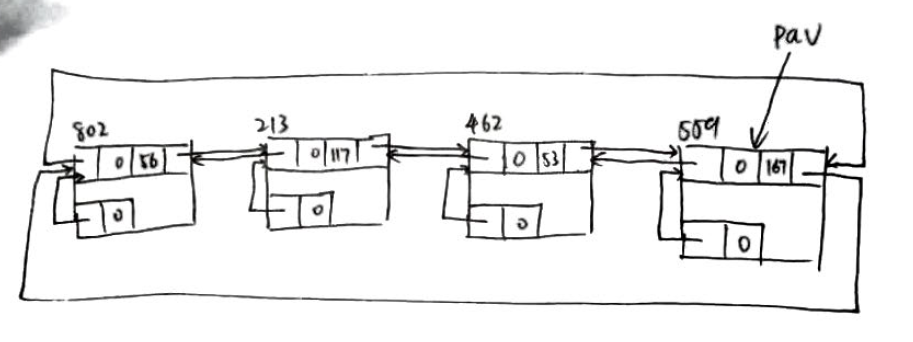
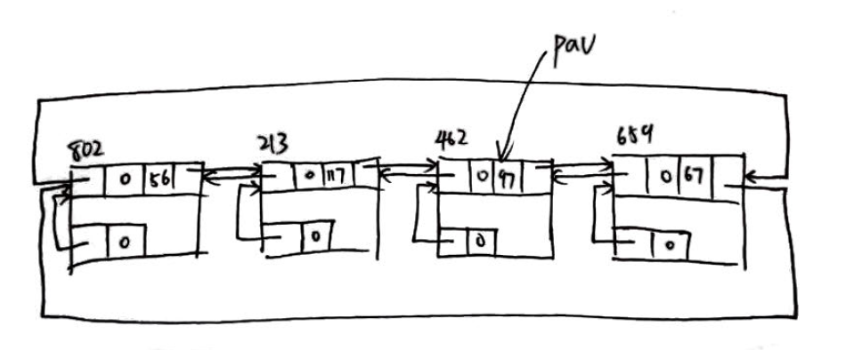
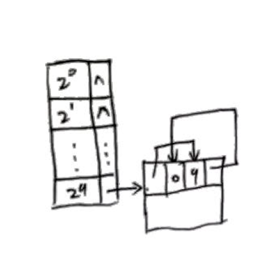
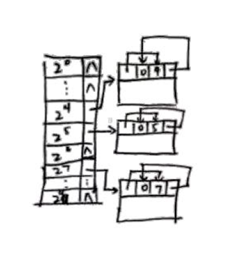
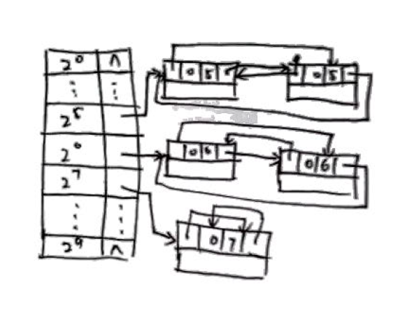

# 数据结构作业
## 第8章

#### 8.1

1. 
2. 

#### 8.7

1. 

2. 
  储存及对应地址为

  | 大小   | 23   | 45   | 52   | 100  | 11   | 19   |
  | ---- | ---- | ---- | ---- | ---- | ---- | ---- |
  | 起始地址 | 0    | 64   | 128  | 256  | 32   | 192  |

3. 

