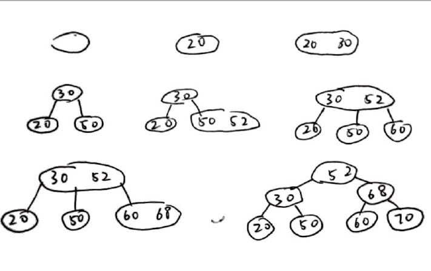

# 数据结构作业

## 第9章

#### 9.1

1. 相同, 都为$n+1$
2. 不同, 有序表为$\log_2 (n+1) - 1$无序表为$\frac{n+1}{2}$
3. 不同, 设有$m$个相同的元素, 有序表为$\log_2 (n+1) - 1+m$, 无序表需遍历全表, 为$n+1$

#### 9.14



#### 9.19

| 0    | 1    | 2    | 3    | 4    | 5    | 6    | 7    | 8    | 9    | 10   |
| ---- | ---- | ---- | ---- | ---- | ---- | ---- | ---- | ---- | ---- | ---- |
| 22   | 67   | 41   | 30   |      | 53   | 46   |      | 13   |      | 01   |

平均查找长度 ASL = $\frac{1}{8}(1 \times 4 + 2 \times 2 + 3 + 6) = 2.125$ 

#### 9.24

1. 在校最大人数为$25 \times 4 \times (200 + 50) = 25000$ (系数\*年级数\*(本科生人数+研究生人数)), 故装载因子为$\alpha = 25000/25000 = 1$

2. 已知$key=c_1c_2c_3c_4c_5c_6c_7c_8$, 定义哈希函数$H_1(key) = c_3c_4*1000+(c_1c_2-96)*250 + c_5*200+c_6c_7c_8 - 1$

   理论上这个哈希函数不会产生簇聚

3. 不能找到2中的$H_1$那样的无冲突哈希函数, 定义哈希函数$H_2(key) = 600c_3c_4+150(c_1c_2-96) + 130c_5\\\quad\quad\quad\quad\quad+((130(1-c_5)+20c_5) -| (130(1-c_5)+20c_5) -c_6c_7c_8|) - 1$

   当发生冲突, $H_{2i}(key)=(H_2(key)+i*150)\; MOD\;15000$

4. ```c
   //描述H_2
   int H_2(key){
     major_num = c_3*10+c_4;				// 系编号
     year = c_1*10+c_2;					// 入学年份
     st_num = 260 - c_6*100+c_7*10+c_8;	// 学生编号
     // 对学生编号进行处理
     if (c_5 == 0 && st_num > 130){ 		// 是本科生且编号大于130, 反向映回
       st_num = 261 - st_num;				// 如135变成126
     }
     else if (c_5 == 1 && st_num > 20){	// 若是研究生且编号大于20, 反向映回
       st_num = 41 - st_num;				// 如31变成10
     }
     // 哈希值
     hash = major_num*600+(year-96)*150+c_5*130 + st_num - 1;
     return hash;
   }

   // 查找
   Status search(HashTable, key, *p){
     // 用p来返回查找或插入位置
     *p = H_2(key);
     while(HashTable.ele[*p] != NULL &&
          	HashTable.ele[*p].key != key){	// 当地址冲突, 哈希值增加150
       *p = (*p + 150)%15000;				// 即变到下一年级(下一系)同一位置, 取模保证不越界
     }
     if (HashTable.ele[*p].key != key){	// 若没有查到, *p是插入的位置
       return FAIL							// 返回失败
     }
     else{									// 若查到了, *p是元素所在位置
       return SUCCESS						// 返回成功
     }
   }
   ```


#### 9.29

1. ```c
   #include <stdio.h>
   #include <stdlib.h>

   #define TYPE int // 默认节点元素类型为int

   /* 结构体定义 */
   typedef enum Status {
       FAIL = -1,
       SUCCESS = 0
   } Status;

   typedef struct Node
   {
       TYPE key;
       struct Node *next;
   } Node;

   typedef struct List
   {
       Node *h;
       Node *t;
   } List;

   /********************************************
   Function name:  search
   Purpose:        搜索指定顺序表L中的元素key, 
                   返回值为成功或失败, 算法采用递归
   Params:
       @List       L:      要搜索的表
       @TYPE       key:    要搜索的元素
   Return:         Status
       SUCCESS:    查找成功, 此时L.t即所找元素
       FAIL:       查找失败
   ********************************************/
   Status search(List L, TYPE key)
   {
       if (L.t->key == key) // 当找到, 直接返回
       {
           return SUCCESS;
       }
       else if (L.t->key > key) // 当当前元素大于目标元素
       {                        // 返回起始点h
           if (L.t != L.h)
           {
               L.t = L.h;
               search(L, key);
           }
           else // 若当前即是起始点, 停止搜索, 返回失败
           {
               return FAIL;
           }
       }
       else //当当前元素小于目标元素
       {    // 前往当前点的下一个
           if (L.t->next != NULL && L.t->next->key <= key)
           {
               L.t = L.t->next;
               search(L, key);
           }
           else // 若达到表尾或下一个值大于目标值, 返回失败
           {
               return FAIL;
           }
       }
   }
   ```

2. ```flow
   st=>inputoutput: 输入L, key
   s=>start: 开始
   end=>end: 结束
   cd1=>condition: L.t->key == key
   cd2=>condition: L.t->key > key
   cd3=>condition: L.t != L.h
   cd4=>condition: L.t->next != NULL\
   && L.t->next->key <= key
   op1=>operation: L.t = L.h
   op2=>operation: L.t = L.t->next
   success=>inputoutput: 返回SUCCESS
   fail=>inputoutput: 返回FAIL

   s->st->cd1(left)
   success->end
   fail->end
   cd1(yes, right)->success
   cd1(no)->cd2
   cd2(yes, right)->cd3
   cd2(no)->cd4
   cd3(yes, right)->op1
   cd3(no)->fail
   cd4(yes, right)->op2
   cd4(no)->fail
   op1(right)->cd1
   op2(right)->cd1
   ```

   $ASL  = \sum_{i=0}^{n-1}  (\sum_{j=0}^{i-1} (j+1) + \sum_{j=i}^{n-1} (j-i))/n^2 = \sum_{i=0}^{n-1}(\frac{i(i+1)}{2} + \frac{(n-1-i)(n-i)}{2})/n^2 = \frac{2n^2+3n+1}{6n}$

#### 9.33

```c
#include <stdio.h>
#include <stdlib.h>
#include "BiTree.h"

#define TYPE int // 默认节点元素类型为int

/********************************************
Function name:  print_bst
Purpose:        从大到小打印二叉查找树T中大于x的元素
Params:
    @BiTree     T:  要打印的树
    @TYPE       x:  要比较的元素
Return:         void
********************************************/
void print_bst(BiTree T, TYPE x)
{
    if (T->data)                          // 若节点非空, 进行打印操作, 否则直接退出
    {                                     //
        if (T->data == x)                 // 当节点元素和x相等
        {                                 //
            print_bst(T->right_child, x); // 先打印右树
            printf("%d", T->data);        // 再打印本身
            print_bst(T->left_child, x);  // 最后打印左树
        }
        else if (T->data < x)             // 当节点元素小于x
        {                                 // 所有想要的元素都在右树
            print_bst(T->right_child, x); // 打印右树
        }                                 //
        else                              // 当节点大于x
        {                                 // 所有想要的元素都在左树
            print_bst(T->left_child, x);  // 打印左树
        }
    }
}
```


#### 9.42

```c
#include <stdio.h>
#include <string.h>
#include <stdlib.h>
#include "TrieTree.h"

#define ORD(c) (int)c - 'a' // 字母在字母表中的顺序

/********************************************
Function name:  insert_trie
Purpose:        将关键词word插入Trie树T, 最大深度为max_depth
                默认所有word是由小写字母组成的
Params:
    @TrieTree   T:          要插入的TrieTree
    @char       *word:      要插入的关键字, 必须为小写字母组成
    @int        max_depth:  设定的最大树深度
Return:         Status
    SUCCESS:    插入成功
    FAIL:       插入失败
********************************************/
Status insert_trie(TrieTree T, char *word, int max_depth)
{
    TrieNode *p = T;
    for (int i = 0; i < max_depth && i < strlen(word); i++) // 循环word的每一个字符
    {                                                       // 直到超过最大深度或遍历完word
        if (p && p->kind == BRANCH)                         // 若节点非空, 且是分支节点
        {                                                   //
            if (p->bh.ptr[ORD(word[i])])                    // 当对应的下一个节点非空
            {                                               // 推进到下一个节点
                p = p->bh.ptr[ORD(word[i])];
            }
            else // 当下一个节点是空的
            {    // 将word存入叶子节点, 并插入
                TrieNode *temp_lf = (TrieNode *)malloc(sizeof(TrieNode));
                temp_lf->kind = LEAF;
                temp_lf->lf.info = word;
                p->bh.ptr[ORD(word[i])] = temp_lf;
                p->bh.num++;
            }
        }
        else if (p && p->kind == LEAF)                        // 当前节点非空且是叶子节点
        {                                                     //
            if (*(p->lf.info) == *word || i == max_depth - 1) // 若节点的值就是word值, 无序插入
            {                                                 // 或最大已经达到最大深度, 当前词被作为同义词
                return SUCCESS;                               // 返回成功
            }                                                 //
            else                                              // 若节点不是word值, 且未达最大深度
            {                                                 // 分裂叶子节点为分支节点, 并插入新叶子
                TrieNode *temp_lf = (TrieNode *)malloc(sizeof(TrieNode));
                temp_lf->kind = LEAF;
                temp_lf->lf.info = word;

                TrieNode *temp_bh = (TrieNode *)malloc(sizeof(TrieNode));
                temp_bh->kind = BRANCH;
                temp_bh->bh.ptr[ORD(p->lf.info[i])] = p;
                temp_bh->bh.ptr[ORD(word[i])] = temp_lf;
                p = temp_bh;
                return SUCCESS;
            }
        }
        else // 若节点是空的
        {    // 插入失败
            return FAIL;
        }
    }
    return FAIL; // 循环结束且没有返回值, 插入失败
}
```


#### 9.43

```c
#include <stdio.h>
#include <string.h>
#include <stdlib.h>
#include "TrieTree.h"

#define ORD(c) (int)c - 'a' // 字母在字母表中的顺序

/********************************************
Function name:  delete_trie
Purpose:        将关键词word从Trie树T删除, 最大深度为max_depth
                默认所有word是由小写字母组成的
Params:
    @TrieTree   T:          要删除的TrieTree
    @char       *word:      要删除的关键字, 必须为小写字母组成
    @int        max_depth:  设定的最大树深度
Return:         Status
    SUCCESS:    删除成功
    FAIL:       删除失败
********************************************/
Status delete_trie(TrieTree T, char *word, int max_depth)
{
    TrieNode *p = T;
    for (int i = 0; i < max_depth && i < strlen(word); i++) // 循环word的每一个字符
    {                                                       // 直到超过最大深度或遍历完word
        if (p && p->kind == BRANCH)                         // 若节点非空, 且是分支节点
        {                                                   //
            TrieNode *next = p->bh.ptr[ORD(word[i])];       // 给出下一个对应节点
            if (next && next->kind == BRANCH)               // 若对应的下一个节点非空且是分支节点
            {                                               // 推进到下一个节点
                p = next;
            }
            else if (next && next->kind == LEAF)             // 若对应的下一个非空且是叶子节点
            {                                                        //
                if (*(next->lf.info) == *word || i == max_depth - 2) // 若叶子的值就是word 
                {                                                    // 或是倒数第二层
                    next = NULL;                                     // 删掉该节点
                    p->bh.num--;                                     // 把分支节点p计数减1
                    if (p->bh.num == 1)                              // 若分支节点p计数是1
                    {                                                // 尝试合并分支节点p
                        TrieNode *sub_node;                          //
                        for (int j = 0; j < 27; j++)                 // 遍历p找到唯一的子节点
                        {                                            //
                            sub_node = p->bh.ptr[j];                 //
                            if (sub_node)                            //
                                break;                               //
                        }                                            //
                        if (sub_node->kind == LEAF)                  // 若子节点是叶子
                            p = sub_node;							 // 合并, 否则不操作
                    }
                    return SUCCESS; // 删除成功
                }
                else // 没有找到要删除的点, 删除失败
                {
                    return FAIL;
                }
            }
            else // 当下一个节点是空的
            {    // 删除失败
                return FAIL;
            }
        }
        else // 若节点是空的或是叶子节点
        {    // 删除失败
            return FAIL;
        }
    }
    return FAIL; // 循环结束且没有返回值, 删除失败
}
```

